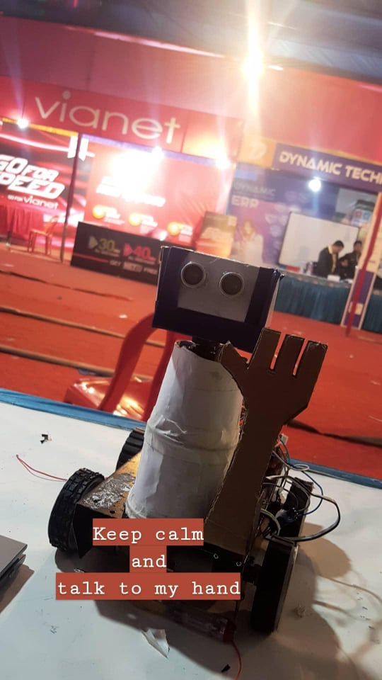

# CAN-Bot

CAN-Bot is an Arduino based bot developed for CAN InfoTech Birgunj 2019. It was developed to teach school students about robotics.

## Components Used

1. Arduino Uno
2. Ultrasonic Sensor HC-SR04
3. Servo Motor
4. Bluetooth module HC-05
5. Motor Driver L298N
6. BO motor *4
7. LiPo battery

## Images

   

## Working

Ultrasonic sensor is attached to the top of bot and acts as its eye. Whenever an object is detected, it will stop at its location and Depending on the proximity of the obstacle it will either wave its hand or node its head. It can be controlled via bluetooth device. The configuration for the bluetooth control is defined in the code.